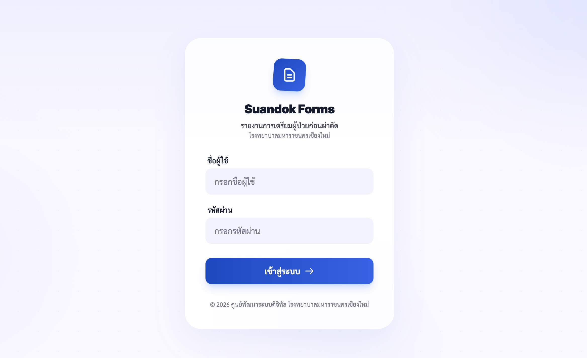
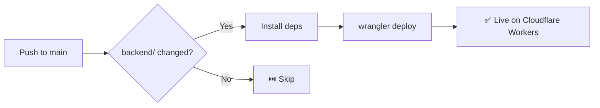

<p align="center">
  
</p>

<h1 align="center">🏥 Hospital Pre-Operative Checklist System</h1>

<p align="center">
  A full-stack web application for managing <strong>pre-operative patient preparation checklists</strong> — digitizing the surgical readiness workflow for nursing staff.
</p>

<p align="center">
  
  
  
  
  
  
</p>

---

## 📋 Overview

Hospital staff traditionally use **paper-based checklists** before surgery — tracking patient identity, lab results, consent forms, IV lines, medications, and more. This system replaces that paper process with a **real-time digital workflow**.

**Key workflow:**
1. Nurse creates a new pre-op form for a patient (by HN / Hospital Number)
2. Each checklist item is checked off with timestamp and preparer name
3. Dashboard shows live status: 🔴 Not Started → 🟡 In Progress → 🟢 Ready for Surgery
4. After surgery, the form is marked as complete and archived

---

## ✨ Features

| Feature | Description |
|---|---|
| 📝 **Digital Checklist Forms** | 12-item pre-op checklist with Yes/No, timestamp, and preparer tracking |
| 🔍 **Patient Search** | Instant search by HN (Hospital Number) |
| 📊 **Live Status Dashboard** | Color-coded status (🔴🟡🟢) with date filtering and pagination |
| 🔐 **JWT Authentication** | Login with access + refresh token rotation |
| 👥 **Role-Based Access** | Admin vs. User roles — admins manage users and see all records |
| 📱 **QR Code Generation** | Each form generates a QR code for quick lookup |
| ✅ **Surgery Completion** | Mark patients as post-surgery; completed forms auto-hide from active view |
| 🔒 **Immutable Records** | Submitted forms cannot be edited or deleted (medical compliance) |

---

## 🏗️ Architecture

```
┌──────────────────────────────┐     ┌──────────────────────────────┐
│         FRONTEND             │     │          BACKEND             │
│                              │     │                              │
│  React 19 + TypeScript       │────▶│  Hono (Cloudflare Workers)   │
│  Tailwind CSS v4             │     │  Drizzle ORM                 │
│  Vite 7                      │     │  Cloudflare D1 (SQLite)      │
│  React Router v7             │     │  JWT Auth + Zod Validation   │
│                              │     │                              │
└──────────────────────────────┘     └──────────────────────────────┘
```

### Frontend (`/frontend`)

| Technology | Purpose |
|---|---|
| React 19 | UI Components |
| TypeScript | Type safety |
| Tailwind CSS v4 | Styling |
| Vite 7 | Build tool & dev server |
| React Router v7 | Client-side routing |
| GSAP | Animations |
| Sonner | Toast notifications |
| Lucide React | Icons |
| react-datepicker | Thai Buddhist Era date picker |

### Backend (`/backend`)

| Technology | Purpose |
|---|---|
| Hono | Lightweight web framework |
| Cloudflare Workers | Serverless runtime (edge) |
| Cloudflare D1 | SQLite database at the edge |
| Drizzle ORM | Type-safe SQL queries |
| Zod | Request validation |
| JWT | Authentication (access + refresh tokens) |

---

## 🗂️ Project Structure

```
Pre_operative_Checklist/
├── .github/
│   └── workflows/
│       └── deploy-backend.yml  # CI/CD: Auto-deploy backend on push
│
├── frontend/
│   ├── src/
│   │   ├── components/       # Reusable UI components
│   │   │   ├── form/         # Form-specific components
│   │   │   └── ui/           # Generic UI (Skeleton loaders, etc.)
│   │   ├── contexts/         # React Context (AuthContext)
│   │   ├── hooks/            # Custom React hooks
│   │   ├── lib/              # API client
│   │   ├── pages/            # Page components
│   │   │   ├── Login.tsx     # Authentication page
│   │   │   ├── Dashboard.tsx # Main dashboard with patient list
│   │   │   ├── FormNew.tsx   # Create new pre-op checklist
│   │   │   ├── FormView.tsx  # View/update existing form
│   │   │   ├── Search.tsx    # Search patients by HN
│   │   │   └── AdminUsers.tsx# User management (admin only)
│   │   ├── services/         # API service layer
│   │   ├── types/            # TypeScript type definitions
│   │   └── utils/            # Helper functions
│   └── vite.config.ts
│
├── backend/
│   ├── db/
│   │   └── schema.ts         # Drizzle ORM schema (users + preop_forms)
│   ├── routes/
│   │   ├── auth.ts           # Login, refresh token, init admin
│   │   ├── forms.ts          # CRUD for pre-op checklist forms
│   │   └── users.ts          # User management (admin)
│   ├── middleware/
│   │   └── auth.ts           # JWT verification middleware
│   ├── lib/
│   │   └── password.ts       # Hashing, token creation utilities
│   ├── drizzle/              # DB migrations
│   ├── index.ts              # App entry point (Hono server)
│   └── wrangler.toml         # Cloudflare Workers config
│
└── README.md
```

---

## 🔌 API Endpoints

**How to read this table:**

- **Method** — The HTTP verb: `GET` = read data, `POST` = create new data, `PATCH` = update partial data
- **Endpoint** — The URL path to call (e.g. `http://localhost:8787/api/auth/login`)
- **Auth** — `Public` = anyone can call without logging in, `🔐 Required` = must send a JWT token (login first)

| Method | Endpoint | Description | Auth |
|---|---|---|---|
| `POST` | `/api/auth/init` | Create first admin user | Public |
| `POST` | `/api/auth/login` | Login → get tokens | Public |
| `POST` | `/api/auth/refresh` | Refresh access token | Public |
| `GET` | `/api/auth/me` | Get current user info | 🔐 Required |
| `GET` | `/api/forms` | List forms (paginated, filterable) | 🔐 Required |
| `POST` | `/api/forms` | Submit new pre-op form | 🔐 Required |
| `GET` | `/api/forms/search?hn=` | Search forms by HN | 🔐 Required |
| `GET` | `/api/forms/:id` | Get form by ID | 🔐 Required |
| `PATCH` | `/api/forms/:id/surgery-completed` | Mark surgery as done | 🔐 Required |
| `GET` | `/api/users` | List all users (admin only) | 🔐 Required |
| `POST` | `/api/users` | Create new user (admin only) | 🔐 Required |

> **Note:** There is no self-registration. Only admins can create new user accounts via `/api/users` or the Admin panel in the UI. Auth endpoints (`login`, `refresh`, `init`) are public because users need to access them *before* they have a token.

---

## 🚀 Getting Started

### Prerequisites

- **Node.js** ≥ 18
- **npm** ≥ 9
- **Wrangler CLI** (for Cloudflare Workers)

### 1. Clone the repository

```bash
git clone https://github.com/Nut-Natthawut/Pre_operative_Checklist.git
cd Pre_operative_Checklist
```

### 2. Setup Backend

```bash
cd backend
npm install

# Run database migrations (local)
npm run db:migrate

# Start the backend dev server
npm run dev
```

The API will be available at `http://localhost:8787`

### 3. Setup Frontend

```bash
cd frontend
npm install

# Start the frontend dev server
npm run dev
```

The app will be available at `http://localhost:5173`

### 4. Initialize Admin Account

On first run, call the init endpoint to create the default admin:

```bash
curl -X POST http://localhost:8787/api/auth/init
```

Default credentials: `admin` / `admin123`

> ⚠️ **Change the password after first login.**

---

## 📦 Deployment

### Backend → Cloudflare Workers (Manual)

```bash
cd backend

# Set JWT secret
wrangler secret put JWT_SECRET

# Run migrations on production D1
npm run db:migrate:prod

# Deploy
npm run deploy
```

### Frontend → Vercel / Cloudflare Pages

```bash
cd frontend
npm run build
# Deploy the `dist/` folder to your hosting provider
```

---

## 🔄 CI/CD Pipeline

The backend is automatically deployed via **GitHub Actions** whenever code is pushed to `main`.



### How it works

| Step | What happens |
|---|---|
| **Trigger** | Push to `main` branch, only when files in `backend/**` change |
| **Runner** | `ubuntu-latest` on GitHub Actions |
| **Build** | Install Node.js 20 + `npm install` |
| **Deploy** | `npx wrangler deploy` to Cloudflare Workers |
| **Manual** | Can also be triggered manually via `workflow_dispatch` |

### Required GitHub Secrets

| Secret | How to get it |
|---|---|
| `CLOUDFLARE_API_TOKEN` | [Cloudflare Dashboard](https://dash.cloudflare.com/profile/api-tokens) → Create Token → "Edit Cloudflare Workers" template |

> **Note:** The frontend is deployed separately via Vercel (auto-deploys on push). The CI/CD pipeline only handles the backend.

---

## 🛡️ Security

- **JWT Authentication** with short-lived access tokens (8h) and refresh tokens
- **CORS** restricted to allowed origins only (localhost + `*.vercel.app` + `*.pages.dev`)
- **Password Hashing** for all user accounts
- **Role-Based Access Control** — admin vs. user permissions
- **Immutable Medical Records** — forms cannot be edited or deleted after submission
- **Cloudflare Secrets** — JWT secret stored securely, not in code

---

## 📄 License

This project is for educational and demonstration purposes.

---

<p align="center">
  Built with ❤️ using React, Hono, and Cloudflare Workers
</p>
