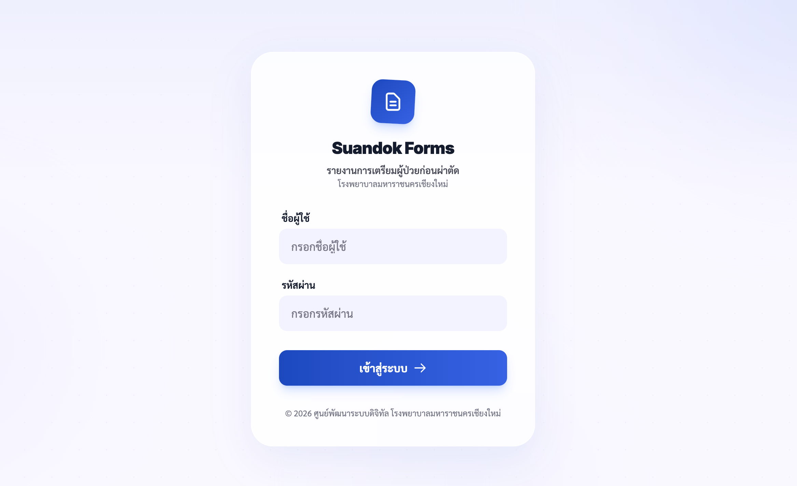

# Hospital Pre-Operative Checklist System

<p align="center">
  A full-stack web application for managing <strong>pre-operative patient preparation checklists</strong> by digitizing the surgical readiness workflow for hospital staff.
</p>

<p align="center">
  
  
  
  
  
  
</p>

A real-time checklist system designed to replace paper-based pre-operative preparation with a structured digital workflow. The system supports patient search, checklist submission, role-based access, and surgery completion tracking.

## Screenshots

<table>
  <tr>
    <td align="center">
      <strong>Homepage</strong><br>
      
    </td>
    <td align="center">
      <strong>Dashboard</strong><br>
      
    </td>
    <td align="center">
      <strong>Login</strong><br>
      
    </td>
  </tr>
</table>


## Overview

Hospital staff traditionally rely on paper-based checklists before surgery to track patient identity, consent forms, lab results, IV lines, medications, and preparation status. This project replaces that process with a digital workflow that is easier to monitor, search, and manage in real time.

**Key workflow**
1. Create a new pre-operative form for a patient by hospital number (HN)
2. Complete checklist items with timestamp and preparer tracking
3. Monitor progress from not started to in progress and ready for surgery
4. Mark surgery as completed and archive the form from the active workflow

## Main Features

- 12-item digital pre-operative checklist with Yes/No status, timestamps, and preparer tracking
- Patient search by hospital number (HN)
- Live dashboard with filtering, pagination, and progress status
- JWT authentication with access and refresh token flow
- Role-based access for admin and staff users
- QR code generation for fast form lookup
- Surgery completion flow with automatic archive behavior
- Immutable submitted records for medical compliance

## Tech Stack

- Frontend: React, TypeScript, Vite, Tailwind CSS
- Backend: Hono, Cloudflare Workers
- Database: Cloudflare D1 (SQLite)
- ORM: Drizzle ORM
- Validation: Zod
- Authentication: JWT

## Architecture

```txt
Frontend (React + Vite)
-> Hono API on Cloudflare Workers
-> Cloudflare D1 with Drizzle ORM

Admin / Staff
-> Authentication + Role-Based Access
-> Checklist Submission and Tracking
-> Dashboard and Surgery Completion Workflow
```

## Project Structure

```
Pre_operative_Checklist/
├── .github/
│   └── workflows/
│       └── deploy-backend.yml  # CI/CD: Auto-deploy backend on push
│
├── frontend/
│   ├── src/
│   │   ├── components/       # Reusable UI components
│   │   │   ├── form/         # Form-specific components
│   │   │   └── ui/           # Generic UI (Skeleton loaders, etc.)
│   │   ├── contexts/         # React Context (AuthContext)
│   │   ├── hooks/            # Custom React hooks
│   │   ├── lib/              # API client
│   │   ├── pages/            # Page components
│   │   │   ├── Login.tsx     # Authentication page
│   │   │   ├── Dashboard.tsx # Main dashboard with patient list
│   │   │   ├── FormNew.tsx   # Create new pre-op checklist
│   │   │   ├── FormView.tsx  # View/update existing form
│   │   │   ├── Search.tsx    # Search patients by HN
│   │   │   └── AdminUsers.tsx# User management (admin only)
│   │   ├── services/         # API service layer
│   │   ├── types/            # TypeScript type definitions
│   │   └── utils/            # Helper functions
│   └── vite.config.ts
│
├── backend/
│   ├── db/
│   │   └── schema.ts         # Drizzle ORM schema (users + preop_forms)
│   ├── routes/
│   │   ├── auth.ts           # Login, refresh token, init admin
│   │   ├── forms.ts          # CRUD for pre-op checklist forms
│   │   └── users.ts          # User management (admin)
│   ├── middleware/
│   │   └── auth.ts           # JWT verification middleware
│   ├── lib/
│   │   └── password.ts       # Hashing, token creation utilities
│   ├── drizzle/              # DB migrations
│   ├── index.ts              # App entry point (Hono server)
│   └── wrangler.toml         # Cloudflare Workers config
│
└── README.md
```
## Deployment

- Frontend: Vercel
- Backend: Cloudflare Workers
- Database: Cloudflare D1

## CI/CD

The backend is automatically deployed to Cloudflare Workers through GitHub Actions when changes are pushed to the `main` branch.

- Trigger: changes in `backend/**`
- Runner: GitHub Actions
- Deploy target: Cloudflare Workers

## Technical Note

This project stores JWT tokens in localStorage for implementation simplicity. In a more security-sensitive production environment, httpOnly cookies would be a stronger choice.


